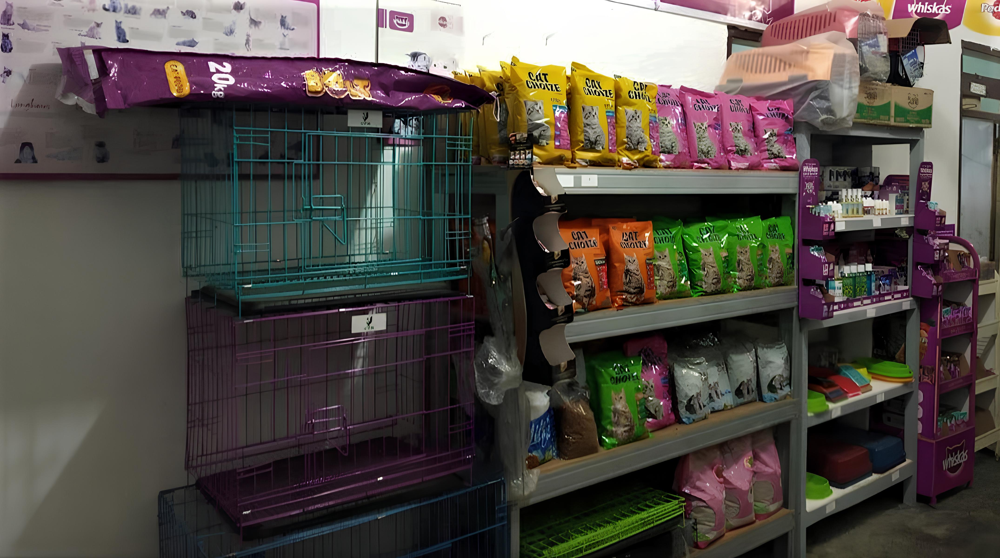
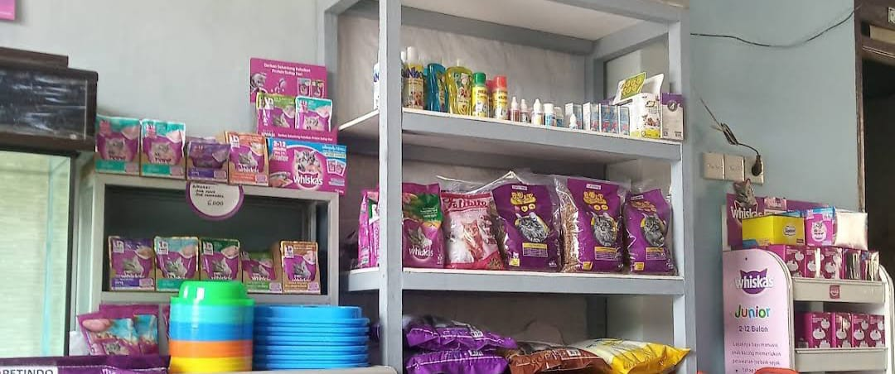
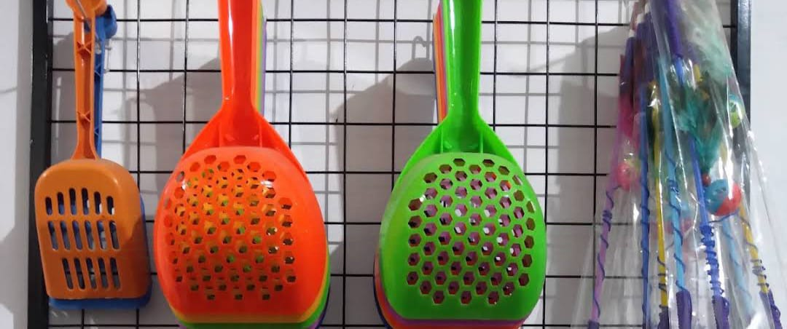

<div align="center">



# Alzi Petshop - Stock Management System

A simple and efficient web application for managing pet shop product inventory.  
Built using native PHP, this app separates roles between sellers and buyers, providing a functional interface to manage and display products to customers.

<p align="center">
  
  
</p>

</div>

---

## ✨ Main Features

- [x] **Product Management (Full CRUD):**
  - `[✓]` **Create:** Sellers can add new products along with details, prices, stock, and images.
  - `[✓]` **Read:** Displays an organized product catalog categorized for buyers.
  - `[✓]` **Update:** Edit existing product information, including images.
  - `[✓]` **Delete:** Remove products from the list.
- [x] **Role-Based Login System:**
  - `[✓]` **Seller:** Access to a dedicated dashboard for managing products and stock.
  - `[✓]` **Buyer:** Can browse products without needing to log in.
- [x] **Stock Management:** Each product includes a stock attribute visible to buyers, with a “Out of Stock” label when inventory reaches zero.
- [x] **Automatic Image Optimization:** Uploaded images are automatically converted to `.webp` format for faster web performance.
- [x] **Responsive Layout:** Interface adapts seamlessly across desktop and mobile devices.
- [x] **Third-Party Integrations:**
  - `[✓]` **Google Maps:** Displays the shop’s physical location to help customers find it easily.
  - `[✓]` **WhatsApp:** A “Contact” button on the product detail page directly opens a WhatsApp chat.

---

## 🛠️ Technologies Used

<div align="center">
    
    
    
    
    
    
</div>

---

## 🚀 Installation & Setup Guide

Follow these steps to run the project in your local environment.

### **1. Prerequisites**

Make sure you have the following software installed:

- **Local Web Server:** [XAMPP](https://www.apachefriends.org/index.html) or WAMP.
- **Web Browser:** Chrome, Firefox, or Edge.

### **2. Setup Steps**

1.  **Clone the Repository**  
    Open the terminal and run the following command:

    ```bash
    git clone https://github.com/your_username/your_repository.git
    ```

2.  **Move the Project Folder**  
    Move the cloned project folder into the `htdocs` directory (for XAMPP) or `www` (for WAMP).

3.  **Database Setup**

    - Open phpMyAdmin (`http://localhost/phpmyadmin`).
    - Create a new database named `alzipetshop`.
    - Select the database, then go to the **"Import"** tab.
    - Upload the `alzipetshop.sql` file located in the project’s root directory.

4.  **Run the Application**
    - Open your browser and go to `http://localhost/project-folder-name`.
    - The application is now ready to use!

---

## 📸 Application Preview

<details>
<summary>Click to view screenshots</summary>
<br>
<table>
  <tr>
    <td><center>Home Page (Product Catalog)</center></td>
  </tr>
  <tr>
    <td><center></center></td>
  </tr>
  <tr>
    <td><center>Product Detail Page</center></td>
  </tr>
  <tr>
    <td><center></center></td>
  </tr>
    <tr>
    <td><center>Seller Dashboard (Product Management)</center></td>
  </tr>
  <tr>
    <td><center></center></td>
  </tr>
</table>
</details>

---

## 📁 Project Structure

The folder structure is designed to separate assets, backend logic, and interface pages.


```
.
├── css/                # File styling CSS kustom & Bootstrap
├── font/               # Font yang digunakan dalam proyek
├── imgs/               # Aset gambar (produk, slide, ikon)
├── js/                 # Skrip JavaScript
├── login/              # Halaman & logika untuk login, register, logout
├── php/                # Skrip backend PHP (koneksi DB, proses form)
├── script/             # Skrip JavaScript tambahan
├── alzipetshop.sql     # File dump database MySQL
├── index.php           # Halaman utama untuk pembeli (katalog)
├── index_p.php         # Halaman utama untuk penjual (dasbor)
├── produk.php          # Halaman untuk menampilkan detail produk
├── tambah.php          # Form untuk menambah produk baru
├── edit.php            # Form untuk mengedit produk
└── README.md           # File yang sedang Anda baca
```

---

## ⚖️ Lisensi

Didistribusikan di bawah Lisensi MIT. Lihat `LICENSE` untuk informasi lebih lanjut.
